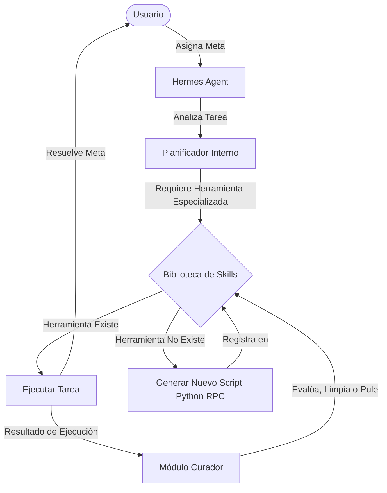

# Documentación Técnica Completa de Hermes Agent

**Hermes Agent** es un framework para agentes autónomos desarrollado y mantenido por **Nous Research**. Está diseñado para ejecutarse en entornos locales o servidores cloud de manera que sea seguro, altamente configurable y capaz de auto-evolucionar creando y refinando sus propias herramientas.

A diferencia de los agentes basados únicamente en chat, Hermes Agent cuenta con un runtime que le permite ejecutar comandos en sistemas de archivos locales o contenedores aislados (Docker/Modal), mantener una base de datos local para memoria persistente y exponer su interfaz tanto en la terminal como a través de pasarelas de mensajería (Telegram, Discord y Slack).

---

## 1. Instalación y Requisitos

### Requisitos Previos
- **Python 3.10 o superior**
- **Git**
- **pip** (administrador de paquetes de Python)
- Acceso a internet para descargar modelos o conectar APIs (ej. OpenRouter).
- *(Opcional)* **Docker** o **cuenta de Modal** si deseas utilizar entornos de ejecución completamente aislados (sandboxed).

### Scripts de Instalación Oficiales
Para instalar el ejecutable global de Hermes, ejecuta el comando correspondiente en tu sistema:

*   **Linux / macOS / WSL2 (Windows Subsystem for Linux) / Android (Termux):**
    ```bash
    curl -fsSL https://hermes-agent.nousresearch.com/install.sh | bash
    ```
*   **Windows (PowerShell Nativo):**
    ```powershell
    iex (irm https://hermes-agent.nousresearch.com/install.ps1)
    ```

Este instalador colocará el comando `hermes` en tu ruta global (`PATH`) y preparará el directorio base en tu carpeta de usuario: `~/.hermes/` (en Windows: `C:\Users\<Usuario>\.hermes\`).

---

## 2. Comandos y Uso de la Interfaz CLI

El comando de entrada `hermes` expone una interfaz de comandos intuitiva. A continuación se detallan los comandos principales:

### `hermes`
Lanza la interfaz de terminal de pantalla completa interactiva (TUI - Terminal User Interface). Aquí puedes conversar directamente con tu agente, ver el árbol de subagentes en ejecución y monitorear la ejecución de comandos.

### `hermes setup`
Inicia el asistente interactivo de configuración. Te guiará paso a paso para configurar tu proveedor de LLM principal, claves de API, almacenamiento, y el entorno de ejecución predeterminado (Sandbox).

### `hermes model`
Permite listar los modelos disponibles en tu proveedor configurado y cambiar rápidamente de modelo interactivo.

### `hermes config`
Este comando te permite interactuar directamente con tu archivo `config.yaml` desde la terminal.
- `hermes config edit`: Abre el archivo de configuración en tu editor predeterminado (ej. nano o VS Code).
- `hermes config set <clave> <valor>`: Actualiza una propiedad del archivo sin tener que abrir el editor.
- `hermes config show`: Muestra la configuración actual en formato YAML.
- `hermes config migrate`: Migra tu configuración a la estructura más reciente si has actualizado la versión de Hermes.

### `hermes gateway`
Gestiona las conexiones a plataformas de mensajería.
- `hermes gateway setup`: Asistente interactivo para configurar tokens de Telegram, Discord o Slack.
- `hermes gateway start`: Inicia el bot en primer plano en la terminal para que escuche mensajes entrantes de las plataformas conectadas.
- `hermes gateway stop`: Detiene el bot de mensajería si está corriendo de forma local.

---

## 3. Estructura de Configuración de Archivos

Toda la configuración del agente reside dentro del directorio oculto del usuario `~/.hermes/`.

### El archivo `config.yaml`
Es el archivo principal que define el comportamiento del agente. Su estructura modular divide las diferentes responsabilidades:

```yaml
# Configuración del LLM
model:
  default: "nousresearch/hermes-3-llama-3.1-405b:free"  # Modelo a utilizar
  provider: "openrouter"                               # Proveedor (openrouter, openai, ollama, google)
  base_url: "https://openrouter.ai/v1"                 # URL base de la API (si aplica)
  temperature: 0.7                                     # Creatividad del modelo
  timeout: 60                                          # Tiempo de espera máximo para respuestas de API

# Entorno de Ejecución (Sandbox)
terminal:
  backend: "local"       # Opciones: local, docker, ssh, modal, singularity
  workdir: "~/hermes_workspace"  # Directorio donde el agente realiza cambios de archivos
  docker_image: "python:3.11-slim"  # Imagen si el backend es Docker

# Comportamiento del Agente
agent:
  max_turns: 90          # Límite máximo de iteraciones por tarea antes de detenerse
  reasoning_effort: "medium" # Esfuerzo de razonamiento (para modelos razonadores)

# Control de Memoria
memory:
  memory_enabled: true         # Habilita el guardado y búsqueda de conversaciones anteriores
  user_profile_enabled: true   # Permite al agente recordar información aprendida sobre ti
  db_path: "~/.hermes/storage/memory.db" # Ruta a la base de datos local SQLite

# Aspecto Visual (Terminal)
display:
  skin: "default"        # Tema visual
  compact: false         # Modo compacto para terminales pequeñas
```

### El archivo `.env`
Contiene las claves API y secretos. **Nunca** debe compartirse ni subirse a repositorios públicos de Git.
```env
OPENROUTER_API_KEY=tu_clave_de_openrouter_aqui
TELEGRAM_BOT_TOKEN=tu_token_de_bot_de_telegram_aqui
TELEGRAM_USER_ID=tu_id_numerico_de_usuario_de_telegram
DISCORD_BOT_TOKEN=tu_token_de_bot_de_discord_aqui
```

---

## 4. Arquitectura de Agentes y Bucle de Aprendizaje

Hermes Agent opera bajo una arquitectura dirigida por objetivos (Goal-Driven Architecture). Cuando le asignas una tarea:



1. **Planificador (Planner):** Divide el problema complejo en sub-tareas manejables.
2. **Subagentes (Subagents):** Para tareas de computación paralela o pipelines complejos, Hermes puede instanciar subagentes aislados con contextos y directivas específicos, reduciendo costos de tokens de contexto global y mejorando la precisión.
3. **Ejecución RPC de Habilidades (Skills):**
   Las habilidades de Hermes son scripts de Python independientes que se comunican mediante llamadas RPC. Si el agente detecta que no tiene una herramienta para una tarea en particular (por ejemplo, buscar datos médicos o analizar un formato de archivo raro), escribe el script de Python necesario en caliente, lo prueba y, si funciona, lo agrega a su biblioteca.
4. **Módulo de Evolución (Curator):**
   En segundo plano, de forma autónoma, el agente ejecuta simulaciones y pruebas sobre sus habilidades creadas. Si encuentra redundancias, mejora el código o descarta scripts obsoletos.
